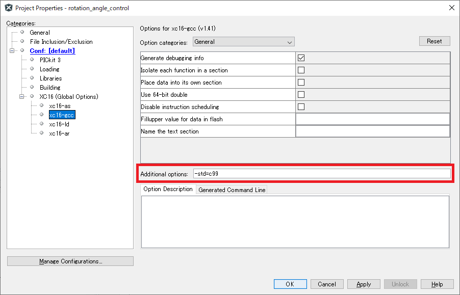
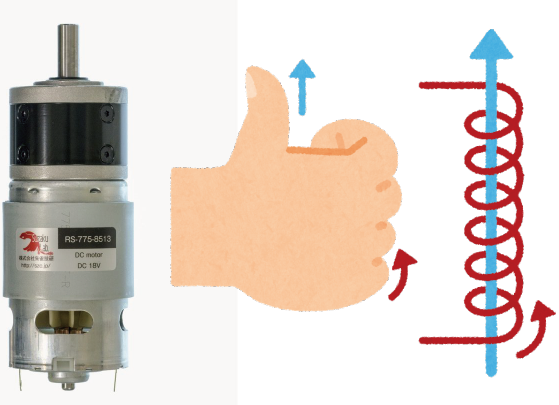

# 概要
モータやエンコーダを使用するのに必要なプログラムをまとめたリポジトリ．下記のプログラムはすべて同一の基板で使用可能．
|プログラム|用途|
|:-|:-|
|pwm_control|デューティー比でモータを制御する|
|revolution_control|回転数でモータを制御する|
|rotation_angle_control|回転角でモータを制御する|
|odometry|接地エンコーダからオドメトリを取得する|
# リファレンス
* [pwm_control](doc/pwm_control.md)
* [revolution_control](doc/revolution_control.md)
* [rotation_angle_control](doc/rotation_angle_control.md)
* [odometry](doc/odometry.md)
# リポジトリ構成
```tree
├── circuit
│   ├── new -> 新版の基板データ ( eagle )
│   └── old -> 旧版の基板データ ( pcbe )
└── program
    ├── odometry.X ---------------> odometry のプログラム
    ├── pwm_control.X ------------> pwm_control のプログラム
    ├── revolution_control.X -----> revolution_control のプログラム
    ├── rotation_angle_control.X -> rotation_angle_control のプログラム
    └── sample -------------------> Raspberry Pi 側のサンプルプログラム
```


# 動作確認環境
* IDE : MPLAB X IDE v4.15
* コンパイラ : XC16 v1.41
* コンパイルオプション : -std=c99
    * File -> Project Properties -> Categories: -> Conf: [default] -> XC16(Global Options) -> xc16-gcc -> Additional options: で指定


# 基板の使用方法
# LEDについて
* 受信ができているときは高速で点滅する
* プログラムの実行中に深刻なエラーが発生したときは一定間隔で点滅する

# 回転量の符号について
* 本リポジトリのプログラムで登場する，「デューティー比，位置カウント，回転角，回転数」の符号は右ねじの法則に従っている．***モータ本体から軸に向かう向きに親指を向けたときの回転方向を正***と定義する．また，***正の方向に回転することを正転***と定義する．
* pwm_control を使って正のデューティ比でモータを駆動したとき，モータが正転しない場合はモータにはんだ付けされている線を入れ替えて回転方向を逆転させなければならない．
* モータの回転方向を逆転させるために，***プログラムで MD に出力する IO ピンを入れ替えないこと．*** 先のことを考えなければこれが一番簡単な方法だが，そのモータを使うときだけ他とは違うプログラムを使わなければならないことになる．これは経験上非常に面倒．
