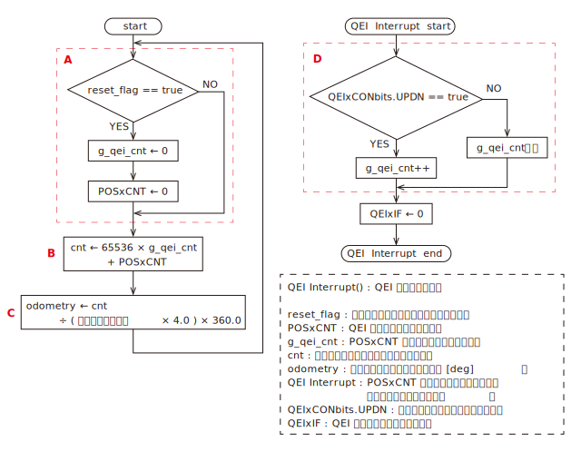

# odometry
### フローチャート

表示

 

***※太字斜体下線の文字列はパラメータで設定する値***

* A : reset_flag の値に応じて値をリセットする．
    * reset_flag は M → S の通信データの 2, 3 番目の「オドメトリ x リセット」を指す．
* B : POSxCNT のオーバーフローを考慮した位置カウントを算出する．
    * POSxCNT は 16 bit のレジスタなので g_qei_cnt に 65536( = 2^16) を乗じている．
* C : エンコーダの回転角度 ( odometry ) を算出する．
    * エンコーダが 1 回転すると「エンコーダ分解能 × 4」の位置カウントが生じる．つまり ( エンコーダ分解能 × 4.0 ) はエンコーダ 1 回転あたりの位置カウントを表す．
    * cnt ÷ ( エンコーダ分解能 × 4.0 ) はエンコーダが何回転したかを表す．これに 360.0 を乗じて [deg] に変換している．
* D : POSxCNT がオーバーフローした回数をカウントする．
    * 説明のために次の２つの語句を定義する．
        * 正のオーバーフロー : 変数の値の取り得る範囲を大きい側に超えること
        * 負のオーバーフロー : 変数の値の取り得る範囲を小さい側に超えること
    * POSxCNT は符号なしでサイズが 16bit の変数なので，値の取り得る範囲は 0 ～ 65535 (2^16 - 1)
    * 65535 + 1 = 65536 ( 0 ) は正のオーバーフロー
    * 0 - 1 = -1 ( 65535 ) は負のオーバーフロー
    * POSxCNT がオーバーフローしたときに QEI 割り込みが発生し，割り込み関数 ( QEI Interrupt ) が呼びだされる．
    * 正のオーバーフローによって QEI 割り込みが発生したとき，QEIxCONbits.UPDN は true に，負のオーバーフローのときは false になる．
    * 正のオーバーフローだったときは g_qei_cnt をインクリメント，負のオーバーフローだったときはディクリメントする．

### 通信データ ( M -> S )
    1. 書き込み禁止
    2. オドメトリ１リセット ( 0 : 通常時，1 : リセット )
    3. オドメトリ２リセット ( 0 : 通常時，1 : リセット )
    4. －
    5. －
### 通信データ ( S -> M )
    1. チャンネル１回転角度 1 ~ 8 bit [deg]
    2. チャンネル１回転角度 9 ~ 16 bit [deg]
    3. チャンネル１回転角度 17 ~ 24 bit [deg]
    4. チャンネル１回転角度 25 ~ 32 bit [deg]
    5. チャンネル２回転角度 1 ~ 8 bit [deg]
    6. チャンネル２回転角度 9 ~ 16 bit [deg]
    7. チャンネル２回転角度 17 ~ 24 bit [deg]
    8. チャンネル２回転角度 25 ~ 32 bit [deg]
### パラメータ
    1. エンコーダ極性 ( 0 or 1 )
    2. エンコーダ分解能 ( 1 ～ )

詳細

* エンコーダ極性
    * 1 にすると出力データの符号を反転する．エンコーダの取り付けられ方に応じて設定する．
* エンコーダ分解能
    * 分解能（１回転で何パルス出力されるか）を指定する
    * 古いエンコーダ ( RE30E-300-213-1 ) は分解能 300，新しいエンコーダ ( AMT102-V ) は DIP スイッチで分解能を設定できる．（分解能 384 で使うことが多い）
    * 新しいエンコーダ ( AMT102-V ) に関して，DIP スイッチと分解能の関係を下図に示す．( [引用元](https://www.cuidevices.com/product/resource/amt10.pdf) )
    

### 使用している周辺モジュール
|モジュール名|用途|
|:-|:-|
|UART1(TX, RX)|マスターとの通信|
|QEI1, QEI2|ロータリーエンコーダ|