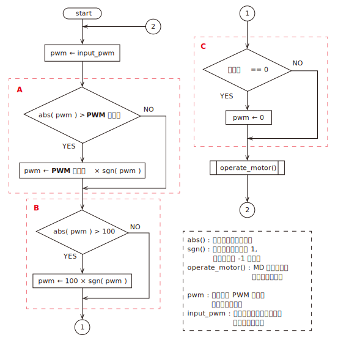

# pwm_control
### フローチャート

表示

 

***※太字斜体下線の文字列はパラメータで設定する値***

* A, B : 出力デューティー比を既定の範囲内に収める処理．
* C : 「有効化」が 0 だったチャンネルはモータを駆動しない．誤作動を防ぐために，***使用しないチャンネルの「有効化」は 0 にすること．***

### 通信データ ( M->S )
    1. 書き込み禁止
    2. PWM1 ( -100 ～ 100 )
    3. PWM2 ( -100 ～ 100 )
    4. －
    5. －
### 通信データ ( S->M )
    1. －
### パラメータ
    1. 有効化 ( 0 or 1 )
    2. PWM 最大値 ( 1 ～ 100 )

詳細

* 有効化
    * 使用するときは 1 にする．
    * 使用しないときは 0 にしておく．
    * ***使用しないのに 1 にしおくと，エンコーダのコネクタから乗ったノイズによって誤動作が起こる可能性がある．***
* PWM 最大値
    * 制御基板から出力する PWM 波形 のデューティー比の最大値
    * 「PWM 最大値」よりも大きな値がマスターから指定された場合は，「PWM 最大値」が代わりに使用される
    * 極力小さな値を指定することで，マスター側のプログラムに不具合が生じてもモータの暴走を防ぐことができる

### 使用している周辺モジュール
|モジュール名|用途|
|:-|:-|
|UART1(TX, RX)|マスターとの通信|
|Timer2       |OC 用|
|OC1, OC2     |DC モータを制御するための PWM|