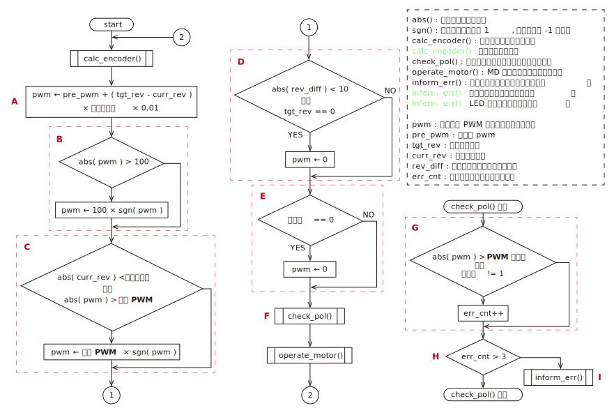
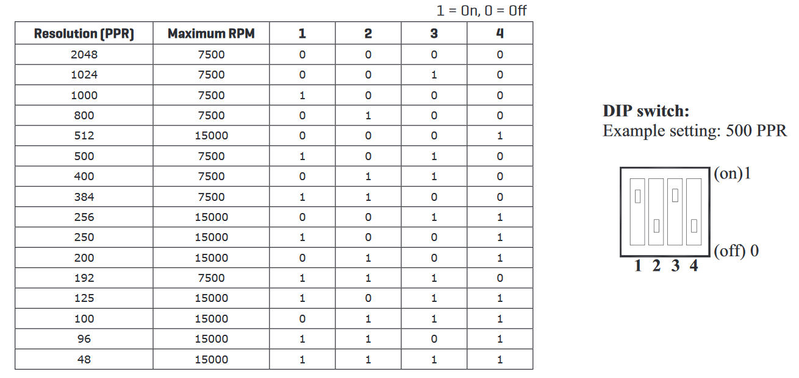

# revolution_control
### フローチャート

表示

 

***※太字斜体下線の文字列はパラメータで設定する値***

* A : 出力デューティー比を決定する式．前回の値を使用しているため，「比例ゲイン」によって加減速の具合を調整できる．
* B : 出力デューティー比を既定の範囲内に収める処理．
* C : 非常停止を解除した際の急加速を防止する処理．
    * 非常停止などによって駆動電源が投入されていない状態で回転数偏差が生じると，駆動電源を投入したとき（非常停止を解除したとき）モータが急加速する可能性がある ( 詳細は「  」を参照 ) ．
    * そこで回転数現在値が「停止回転数」以下になったら駆動電源が投入されていない可能性があると判断して，「停止 PWM」を出力デューティー比の上限にする．
* D : 現在値と目標値の偏差の絶対値が閾値（ 10 [rpm] ）以下になったらモータを停止する．
    * 閾値に関して，変更されなさそうなのでパラメータとして設定できるようにはしていない．
* E : 「有効化」が 0 だったチャンネルはモータを駆動しない．誤作動を防ぐために，***使用しないチャンネルの「有効化」は 0 にすること．***
* F : 「エンコーダ極性」というパラメータが正しいか確認する処理．
    * 説明のために次の２つの語句を定義する．
        * 回転数実測値 : エンコーダから出力されるパルスから計算した回転数
        * 回転数現在値 : 「エンコーダ極性」が 0 のときは回転数実測値と等しい値，「エンコーダ極性」が 1 のときは回転数実測値に -1 を乗じた値．
    * このプログラムはモータが正転したとき ( デューティー比が正のとき ) に回転数現在値が正になる前提で書かれている．エンコーダの取り付けられている向きやギヤのかまされ方に応じてモータ正転時の回転数実測値の符号が変わるため，状況に応じて「エンコーダ極性」の値を適切に設定しなければならない．
    * 「エンコーダ極性」の値が不適切な場合（モータ正転時の回転数現在値が負になってしまう場合），常にプログラムの意図した方向とは逆の方向にモータが回転するため，以下のような流れで暴走してしまう．
        1. 偏差が生じるとモータを駆動して偏差の絶対値を小さくしようとする．
        2. プログラムが意図した方向とは逆の方向に回転してしまう．
        3. 偏差の絶対値が大きくなる．
        4. 偏差の絶対値に比例してモータの出力を上げるため，偏差の絶対値がさらに大きくなる
        5. 「PWM 最大値」になるまでモータの出力が上がる
* G : check_pol() の中核にあたる処理．
    * 出力デューティー比が「PWM 最大値」のときに偏差の絶対値が増加したら，err_cnt をインクリメントする．
* H : 「 G 」の条件を 4 回連続で満たしたら，「 F 」で説明した暴走状態だと判断して inform_err() を呼び出す．
* I : モータを停止して LED を一定の間隔で点滅させ，エラーが発生したことを通知する．

### 通信データ ( M->S )
    1. 書き込み禁止
    2. 目標回転数 1 上位 8 bit [ rpm ]
    3. 目標回転数 1 下位 8 bit [ rpm ]
    4. 目標回転数 2 上位 8 bit [ rpm ]
    5. 目標回転数 2 下位 8 bit [ rpm ]
### 通信データ ( S->M )
    1. 現在の回転数 1 上位 8 bit [ rpm ]
    2. 現在の回転数 1 下位 8 bit [ rpm ]
    3. 現在の回転数 2 上位 8 bit [ rpm ]
    4. 現在の回転数 2 下位 8 bit [ rpm ]
    5. 出力 PWM1 ( -100 ～ 100 )
    6. 出力 PWM2 ( -100 ～ 100 )
### パラメータ
    1. 有効化 ( 0 or 1 )
    2. PWM 最大値 ( 1 ～ 100 )
    3. 停止回転数 ( 1 ～ ) [ rpm ]
    4. 停止 PWM  ( 1 ～ 100 )
    5. 比例ゲイン ( 未使用時：0 / 使用時：1 ～ )
    6. エンコーダ極性 ( 0 or 1 )
    7. エンコーダ分解能 ( 1 ～ )
    8. エラー停止有効化 ( 0 or 1 )

詳細

* 有効化
    * 使用するときは 1 にする．
    * 使用しないときは 0 にしておく．
    * ***使用しないのに 1 にしおくと，エンコーダのコネクタから乗ったノイズによって誤動作が起こる可能性がある．***
* PWM 最大値
    * 制御基板から出力する PWM 波形 のデューティー比の最大値
    * 「PWM 最大値」よりも大きな値がマスターから指定された場合は，「PWM 最大値」が代わりに使用される
    * 極力小さな値を指定することで，マスター側のプログラムに不具合が生じてもモータの暴走を防ぐことができる
* 停止回転数
    * モータが停止したと判断する回転数の最大値を指定する．詳細はフローチャートの「 C 」を参照すること．
* 停止 PWM
    * モータが停止したと判断されたときのデューティー比の上限．詳細はフローチャートの「 C 」を参照すること．
* 比例ゲイン
    * 出力デューティー比を決定する際に使用する．
    * 詳細はフローチャートの「 A 」を参照すること．
    * 大きめの値に設定することによってモータの加減速処理を行うことが可能．ただし，***足回りを制御する際には比例ゲインは小さめにして加減速処理は別に実装する方が好ましい．*** 詳細は「[足回りの加減速処理について](#足回りの加減速処理について)」を参照すること．
* エンコーダ極性
    * エンコーダの取り付けられ方に応じて設定する．詳細はフローチャートの「 F 」を参照すること．
* エンコーダ分解能
    * 分解能（１回転で何パルス出力されるか）を指定する
    * 古いエンコーダ ( RE30E-300-213-1 ) は分解能 300，新しいエンコーダ ( AMT102-V ) は DIP スイッチで分解能を設定できる．（分解能 384 で使うことが多い）
    * 新しいエンコーダ ( AMT102-V ) に関して，DIP スイッチと分解能の関係を下図に示す．( [引用元](https://www.cuidevices.com/product/resource/amt10.pdf) )
    
* エラー停止有効化
    * 停止PWMを超えたときに最大PWM（停止PWM）を出力し続ける場合 0 にする．
    * 停止PWMを超えたときにエラーで停止する場合 1 にする．
    * どちらの場合でもエンコーダーの極性エラーの場合はエラーで停止する．

### 使用している周辺モジュール
|モジュール名|用途|
|:-|:-|
|UART1(TX, RX)|マスターとの通信|
|QEI1, QEI2|ロータリーエンコーダ|
|Timer1|フィードバック制御の計算周期の調整|
|Timer2|OC 用|
|OC1, OC2|DC モータを制御するための PWM|

### 足回りの加減速処理について