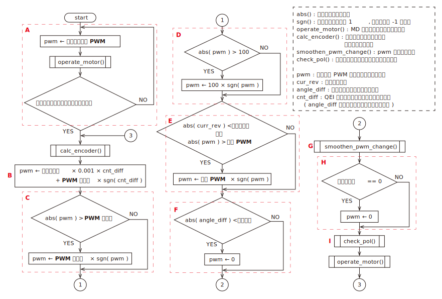
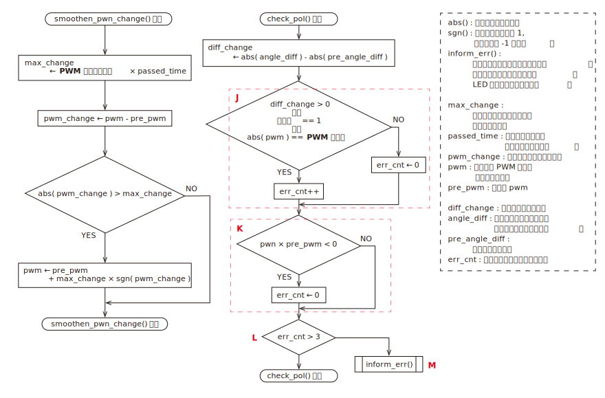

# rotation_angle_control
### フローチャート

表示

 

***※太字斜体下線の文字列はパラメータで設定する値***

* A : ゼロ点合わせの処理にあたる．リミットスイッチが押されるとループを抜けて回転角制御の処理に移行する．
* B : 出力デューティー比を決定する式．ちなみに cnt_diff は「位置カウント目標値 - 位置カウント現在値」で求めている．
* C, D : 出力デューティー比を既定の範囲内に収める処理．
* E : 非常停止を解除した際の急加速を防止する処理．
    * 非常停止などによって駆動電源が投入されていない状態で回転角偏差が生じると，加減速処理が効力を発揮せず，駆動電源を投入すると（非常停止を解除すると）モータが急加速する可能性がある ( 詳細は「 G 」を参照 ) ．
    * そこで回転数現在値が「停止回転数」以下になったら駆動電源が投入されていない可能性があると判断して，「停止 PWM」を出力デューティー比の上限にする．
* F : 現在値と目標値の偏差の絶対値が「許容誤差」以下になったらモータを停止する．
* G : モータの加減速処理
    * 「 B 」式で出力デューティー比を計算しているため，回転角目標値を急激に変化させるなどして回転角偏差の絶対値が大きくなると，出力デューティー比が大きくなってモータが急加速する可能性がある．これを防ぐために単位時間当たりのデューティー比の変化量に制限を設けている（加減速処理）．
    * 加減速処理に関してはフィードバックを行っておらず，モータの状態に関係なく時間が経過すればデューティー比を大きくすることができる．したがって，「 E 」のように駆動電源が投入されている状態では加減速処理が機能しない．
* H : 「有効化」が 0 だったチャンネルはモータを駆動しない．誤作動を防ぐために，<u>***使用しないチャンネルの「有効化」は 0 にすること．***</u>
* I : 「エンコーダ極性」というパラメータが正しいか確認する処理．
    * 以下の２つの語句を定義する．
        * 位置カウント実測値 : エンコーダから出力されるパルスから計算した位置カウント
        * 位置カウント現在値 : 「エンコーダ極性」が 0 のときは位置カウント実測値と等しい値，「エンコーダ極性」が 1 のときは位置カウント実測値に -1 を乗じた値．
    * このプログラムはモータが正転したとき ( デューティー比が正のとき ) に位置カウント現在値が増加する前提で書かれている．エンコーダの取り付けられている向きやギヤのかまされ方に応じてモータ正転時の位置カウント実測値の変化量の符号が変わるため，状況に応じて「エンコーダ極性」の値を適切に設定しなければならない．
    * 「エンコーダ極性」の値が不適切な場合（モータ正転時の位置カウント現在値が減少してしまう場合），常にプログラムの意図した方向とは逆の方向にモータが回転するため，以下のような流れで暴走してしまう．
        1. 偏差が生じるとモータを駆動して偏差の絶対値を小さくしようとする．
        2. プログラムが意図した方向とは逆の方向に回転してしまう．
        3. 偏差の絶対値が大きくなる．
        4. 偏差の絶対値に比例してモータの出力を上げるため，偏差の絶対値がさらに大きくなる
        5. 「PWM 最大値」になるまでモータの出力が上がる

* J : check_pol() の中核にあたる処理．
    * 出力デューティー比が「PWM 最大値」のときに偏差の絶対値が増加したら，err_cnt をインクリメントする．
* K : 出力デューティー比の符号が変わったら err_cnt をクリアする．
    * モータの回転方向が逆転するような回転角目標値が与えられたとき(*1)，「エンコーダ極性」が適切に設定されていたとしても「 J 」の条件を満たしてしまう可能性があるので，err_cnt をクリアする．
* L : 出力デューティー比の符号が変わらずに「 J 」の条件を 4 回連続で満たしたら，「 I 」で説明した暴走状態だと判断して inform_err() を呼び出す．
* M : モータを停止して LED を一定の間隔で点滅させ，エラーが発生したことを通知する．

*1 : 
例として回転角目標値が 1000 [deg], 回転角現在値が 500 [deg] で出力デューティー比が 70% のときに，回転角目標値を 0 [deg] に変更するとモータの回転方向が逆転する．

### 通信データ ( M->S )
    1. 書き込み禁止
    2. 目標回転角 1 上位 8 bit [ deg ]
    3. 目標回転角 1 下位 8 bit [ deg ]
    4. 目標回転角 2 上位 8 bit [ deg ]
    5. 目標回転角 2 下位 8 bit [ deg ]
### 通信データ ( S->M )
    1. 現在の回転角偏差 1 上位 8 bit [ deg ]
    2. 現在の回転角偏差 1 下位 8 bit [ deg ]
    3. 現在の回転角偏差 2 上位 8 bit [ deg ]
    4. 現在の回転角偏差 2 下位 8 bit [ deg ]
    5. 出力 PWM1 ( -100 ～ 100 )
    6. 出力 PWM2 ( -100 ～ 100 )
### パラメータ
    1. 有効化 ( 0 or 1 )
    2. ゼロ点合わせ PWM ( -100 ～ 100 )
    3. PWM 最大値 ( 1 ～ 100 )
    4. PWM 最小値 ( 1 ～ 100 )
    5. 停止回転数 ( 1 ～ ) [ rpm ]
    6. 停止 PWM ( 1 ～ 100 )
    7. PWM 変化量最大値 ( 1 ～ )
    8. 比例ゲイン ( 未使用時：0 / 使用時：1 ～ )
    9. 許容誤差 [ deg ]
    10. エンコーダ極性 ( 0 or 1 )
    11. エンコーダ分解能 ( 1 ～ )

詳細

* 有効化
    * 使用するときは 1 にする．
    * 使用しないときは 0 にしておく．
    * ***使用しないのに 1 にしおくと，エンコーダのコネクタから乗ったノイズによって誤動作が起こる可能性がある．***
* ゼロ点合わせ PWM
    * ゼロ点合わせ時に出力する PWM 波形のデューティー比
    * 負の値を指定することで回転方向を逆転させることができる
    * ゼロ点合わせ用のリミットスイッチが押された時点で急停止させるため，機械的，電気的にダメージの少ない小さめな値を指定すること
* PWM 最大値
    * 制御基板から出力する PWM 波形 のデューティー比の最大値
    * 「PWM 最大値」よりも大きな値がマスターから指定された場合は，「PWM 最大値」が代わりに使用される
    * 極力小さな値を指定することで，マスター側のプログラムに不具合が生じてもモータの暴走を防ぐことができる
* PWM 最小値
    * モータが回転するデューティー比の最小値を指定する
    * 目標値と現在値の偏差の絶対値が小さいときの微調整に使用する
* 停止回転数
    * モータが停止したと判断する回転数の最大値を指定する．詳細はフローチャートの「 E 」を参照すること．
* 停止 PWM
    * モータが停止したと判断されたときのデューティー比の上限．詳細はフローチャートの「 E 」を参照すること．
* PWM 変化量最大値
    * 加減速処理に使用するパラメータ
    * 許容する 1 秒あたりのデューティー比の変化量
    * 例としてこのパラメータを 50 に設定した場合，1 秒間で最大 50% だけデューティー比を変化させることができるため，停止状態（0%）から最大出力（100%）になるまで 2 秒かかることになる．
* 比例ゲイン
    * 出力デューティー比を決定する際に使用する．
    * 詳細はフローチャートの「 B 」を参照すること．
* 許容誤差
    * フィードバック制御で回転角現在値を回転角目標値に近づけていく際，許容する誤差．
    * 偏差が許容誤差以下になったらモータを停止させる．
* エンコーダ極性
    * エンコーダの取り付けられ方に応じて設定する．詳細はフローチャートの「 I 」を参照すること．
* エンコーダ分解能
    * 分解能（１回転で何パルス出力されるか）を指定する
    * 古いエンコーダ ( RE30E-300-213-1 ) は分解能 300，新しいエンコーダ ( AMT102-V ) は DIP スイッチで分解能を設定できる．（分解能 384 で使うことが多い）
    * 新しいエンコーダ ( AMT102-V ) に関して，DIP スイッチと分解能の関係を下図に示す．( [引用元](https://www.cuidevices.com/product/resource/amt10.pdf) )
    

### 使用している周辺モジュール
|モジュール名|用途|
|:-|:-|
|UART1(TX, RX)|Raspberry Pi との送受信|
|QEI1, QEI2|ロータリーエンコーダ|
|Timer1|フィードバック制御の計算周期の調整|
|Timer2|OC 用|
|OC1, OC2|DC モータを制御するための PWM|
|入力変化通知|ゼロ点合わせのリミットスイッチの読み込み|

### トラブルシューティング